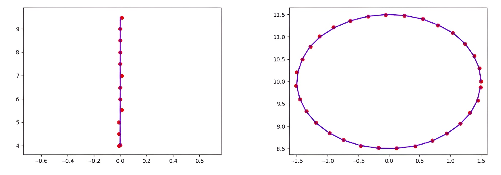

# Genetic Algorithm Library in C++
## Application to Inverse Kinematics of a 5-Bar Parallel Manipulator

--- 
## 1. Overview

This repository provides a reusable C++ Genetic Algorithm (GA) library together with a full working example where the GA is applied to solve the inverse kinematics of a 5-bar parallel robotic manipulator.

The library is complete, object-oriented, binary-encoded, and designed to be easily adapted to any optimization problem.

### Usage Example: 5-bar Mechanism Inverse Kinematics 

The 5-bar manipulator example demonstrates a real engineering application: estimating which joint angles result in the desired Cartesian coordinates through evolutionary optimization. This is an didactic example, solving nonlinear equations with analytical solution (inverse kinematics) point by point. More useful problems can be further establish.
 
#### Forward kinematics (mathematical form) and why the inverse is nonlinear

The forward kinematics implemented in `position(t1, t2, coordinates)` computes the end-effector coordinates \((x,y)\) from the two motor angles \(t_1,t_2\).
Using the notation in the code, let the link lengths be

The radii are \(r_1\), \(r_2\), \(r_3\) (in the code: \(r_1=5\), \(r_2=12\), \(r_3=13.5/2\)).

The code computes intermediate quantities:
\[
e = \frac{r_1(\sin t_1 - \sin t_2)}{2r_3 + r_1\cos t_2 - r_1\cos t_1}, \quad
f = \frac{r_1 r_3(\cos t_2 + \cos t_1)}{2r_3 + r_1\cos t_2 - r_1\cos t_1}.
\]

Define also:
\[
d = 1 + e^2, \quad
g = 2\big( e f - e r_1\cos t_1 + e r_3 - r_1\sin t_1 \big), \quad
h = f^2 - 2f(r_1\cos t_1 - r_3) - 2 r_1 r_3 \cos t_1 + r_3^2 + r_1^2 - r_2^2.
\]

With these symbols the vertical coordinate \(y\) is obtained as a root of:
\[
d y^2 + g y + h = 0,
\]
so the code selects one root by:
\[
y = \frac{-g \pm \sqrt{g^2 - 4 d h}}{2 d}.
\]

Finally the horizontal coordinate is recovered by:
\[
x = e y + f.

---

#### Why solving the inverse problem \((x_w,y_w)\mapsto (t_1,t_2)\) is hard / nonlinear

1. **Trigonometric rational dependence.**  
   The intermediate coefficients \(e\) and \(f\) are **ratios** whose numerators and denominators contain \(\sin t_i\) and \(\cos t_i\). Concretely,
   \[
   e = \frac{r_1(\sin t_1 - \sin t_2)}{2r_3 + r_1(\cos t_2 - \cos t_1)},
   \quad
   f = \frac{r_1 r_3(\cos t_2 + \cos t_1)}{2r_3 + r_1(\cos t_2 - \cos t_1)}.
   \]
   Thus \(x\) and \(y\) are **highly nonlinear** functions of \(t_1,t_2\): trig functions appear both in numerators and inside denominators.

2. **Polynomial + radical structure.**  
   Even after algebraic manipulation, we obtain a quadratic in \(y\) whose coefficients depend nonlinearly on \(\sin t_i,\cos t_i\). The solution uses a square root:
   \[
   y = \frac{-g \pm \sqrt{g^2 - 4 d h}}{2 d}.
   \]
   The discriminant \(g^2 - 4 d h\) is itself a complicated function of \(t_1,t_2\), which may be non-positive for some angle pairs (leading to no real solution for that branch).

3. **Multiple solutions and branches.**  
   The presence of \(\pm\) in the quadratic root means there can be **multiple possible (x,y)** for the same pair \((t_1,t_2)\) (branch choice), and conversely for a given \((x_w,y_w)\) there may be **multiple \((t_1,t_2)\)** that satisfy the equations.

4. **Singular denominators.**  
   The expressions for \(e\) and \(f\) divide by
   \[
   \Delta = 2r_3 + r_1\cos t_2 - r_1\cos t_1.
   \]
   When \(\Delta\to 0\) the forward formulas blow up (the algebraic manipulation is not valid or becomes numerically unstable), which corresponds to **singular configurations** of the mechanism.

5. **Transcendental coupling.**  
   Trying to solve for \(t_1,t_2\) given \((x_w,y_w)\) leads to equations where trig functions appear inside rational expressions and square roots. Those are **transcendental** and generally do not admit closed-form algebraic solutions that are practical to compute for every target.

6. **Nonlinear, non-convex search space.**  
   Small changes in \(t_1,t_2\) can cause large, non-linear changes in \((x,y)\) near singularities or configuration boundaries. This makes direct inversion via simple iterative linear methods (e.g. Newton with a global initial guess) brittle.

---

#### Illustration: inverse as a root-finding problem

To find \((t_1,t_2)\) for a given target \((x_w,y_w)\) we must solve the system
\[
\begin{cases}
x(t_1,t_2) - x_w = 0,\\[4pt]
y(t_1,t_2) - y_w = 0,
\end{cases}
\]
where \(x(t_1,t_2), y(t_1,t_2)\) are given implicitly by the formulas above. Because \(x,y\) involve \(\sin\), \(\cos\), divisions and square roots, this system is:

- **nonlinear** (trigonometric + rational + radical),
- **possibly multimodal** (multiple distinct \((t_1,t_2)\) satisfy the equations),
- **singular** in some regions (denominator zero / discriminant negative).

---

### Conclusion: why use a Genetic Algorithm?

Given the complicated structure above, a *numerical optimizer that does not require analytic inversion or derivatives* is a practical choice. The implemented Genetic Algorithm:

- only needs to **evaluate** the forward kinematics `position(t1,t2)` and a scalar cost (euclidean error),
- does not rely on Jacobians or initial linearization,
- can handle multiple feasible solutions and avoid being trapped by singularities by exploring diverse candidate angles,
- allows rejecting invalid angle sets quickly via `OUT_OF_RANGE`.

Therefore the AG is an appropriate and robust tool for solving the inverse kinematics of this 5-bar manipulator.


---

## 2. Genetic Algorithm – Conceptual Description

The algorithm follows the classical evolutionary procedure:

 - `Population Initialization` – A group of individuals (candidate solutions) is created with random chromosomes.
 - `Fitness Evaluation` – Each chromosome is decoded into its floating-point values (genes), passed to the user cost function, and assigned a cost.
 - `Sorting / Natural Selection` – The population is sorted based on cost (lower = better).
 - `Parent Selection` – Several selectable strategies choose which individuals will breed.
 - `Crossover` – Two-point binary crossover exchanges segments of genetic material.
 - `Mutation` – A controlled percentage of bits are flipped.
 - `Elitism` – The best individuals always remain untouched.
 - `Next Generation` – Offspring replace the non-elite population.
 - `Stopping Conditions` – The algorithm stops either when the desired cost is reached or after a defined number of generations.

Binary representation ensures full control of precision through integer_bits and decimal_bits, while mutation and crossover guarantee exploration.

--

## 3. Selection Variants Implemented

AlgorithmChoice controls which selection method is used:

 - `0 — Random Selection` - Parents are chosen completely at random from the mating pool.
 - `1 — Top-Down` - The best candidate mates with the next best, iteratively down the list.
 - `2 — Tournament Selection` - Three candidates are sampled for each parent; the one with lowest cost wins.
 - `3 — Lottery Selection (Fitness-Proportional)` - Each individual receives a number of “tickets” proportional to its fitness. Parents are chosen by sampling over the ticket ranges.
 - `4 — Top-Down With Incest Prevention` - Checks the Hamming distance between chromosomes and prevents mating if they are too genetically similar. The threshold reduces automatically if no non-incest pair is available.

These variants allow the algorithm to adapt to different difficulty levels, search landscapes, and convergence requirements.

---

## 4. Genetic Library Documentation

The core library consists of three main classes: Gene, Individual, and GeneticAlgorithm.

### 4.1 Class: Gene

Represents a single encoded variable.

**Internal state:**

 - `binaryGene[]` — Array of bits
 - `floatGene` — Decoded floating-point value

**Key behaviors:**

Converts float → binary (fixed precision)
Converts binary → float

Allows direct manipulation of bits (for GA operators)

**Important methods:**

 - `setGene_Float(float)` — Encodes a float into binary
 - `getGene_Float()` — Decodes current binary into float
 - `setBit(value, position)` — Set a specific bit (0/1)
 - `flipBit(position)` — Mutation operator
 - `getBit(position)`
 - `updateFloatGene()` — Recomputes floating-point value from bits
 - `printGene_Binary()`
 - `printGene_Float()`

Because each gene is stored in binary, the GA works naturally with bit-level operations rather than floating-point crossover.

### 4.2 Class: Individual

Represents one complete solution (chromosome).

**Internal state:**
 - `genes[number_of_genes]`
 - `coast` — Cost value

**Key behaviors:**

 - Converts chromosome into a float array
 - Passes values to user cost function
 - Supports mutation, crossover access, and elite preservation

**Important methods:**

 - `coastUpdate(costFunction)` — Recomputes cost using user function
 - `getCoast()`
 - `getChromosome()`
 - `setChromosome(newGenes)`
 - `resetChromosome()` — Initializes chromosome randomly
 - `getGeneBit(geneIndex, bitIndex)`
 - `printChromosome_Float()`
 - `printChromosome_Binary()`

### 4.3 Class: GeneticAlgorithm

Controls the entire optimization process.

**Construction:**

`GeneticAlgorithm ga(&coastFunction);`

**The cost function must match:**

`float coastFunction(array<float, number_of_genes>);`


#### Key behaviors:

 - Generates initial population
 - Evaluates all individuals
 - Sorts and selects parents
 - Performs crossover and mutation
 - Creates next generation
 - Stops when criteria are met
 - Returns the best solution

#### Important public methods:

`float* run()` → Main execution; returns float array with best genes
`getSolution()` → Read best individual at any time
`showSolution()` → Print best solution
`showCommunity(iter)` → Print the entire population
`saveSolution()` → Maintain global best across runs

**Internal steps (automatically executed):**
 - `Selection()`
 - `Mating()`
 - `parentsCrossover()`
 - `Mutation()`
 - `NextGeneration()`
 - `CoastFunctionEvaluation()`

**The user only interacts with:**

 - The constructor
 - .run()
 - The returned chromosome

Everything else is handled inside the library.

## 5. HOW TO USE THE LIBRARY (DETAILED STEP-BY-STEP)

This is the section that helps you integrate the GA into any external project.

### 5.1 Step 1 — Include Headers and Define Parameters

```
#include "genetic.hpp"
#include "parameters.hpp"
```

`parameters.hpp` defines:
 - number_of_genes
 - integer_bits / decimal_bits
 - community_size
 - mutation_percent
 - max iterations
 - boundaries (min/max values)
 - selection algorithm

   
Modify this file to tune the GA.

### 5.2 Step 2 — Write Your Cost Function

The cost function is called once per individual per generation.

Example template with an explanation of each line:

```
float coastFunction(array<float, number_of_genes> genes) {

    // Safety check: if gene value is outside allowed range, discard this individual
    if (genes[0] < min_gene_value || genes[0] > max_gene_value)
        return OUT_OF_RANGE;
    if (genes[1] < min_gene_value || genes[1] > max_gene_value)
        return OUT_OF_RANGE;

    // Map genes to your mathematical model
    float x = /* compute model from genes */;
    float y = /* compute model from genes */;

    // Compute cost: lower = better
    float cost = sqrt((x - targetX)^2 + (y - targetY)^2);

    return cost;
}
```

Important notes:

You can return huge values or OUT_OF_RANGE to mark invalid chromosomes.

The GA always tries to minimize the cost.

### 5.3 Step 3 — Instantiate the GA

`GeneticAlgorithm ga(&coastFunction);`

This binds the user-defined cost function to the GA.

### 5.4 Step 4 — Run the Algorithm
`float* solution = ga.run();`

Inside `.run()`:

 - The population is initialized.
 - For each generation:
  - All individuals are evaluated.
  - They are sorted.
  - Parents are chosen based on the selected strategy.
  - Crossover produces new genes.
  - Mutation injects diversity.
  - Elitism preserves the best individuals.
 - The loop ends when convergence is reached.

### 5.5 Step 5 — Use the Solution

The returned array contains the best gene values as floats:

```
float best_0 = solution[0];
float best_1 = solution[1];
```

These correspond to decoded chromosomes.

### 5.6 Step 6 — Free Memory

Because `.run()` allocates a float array: delete[] solution;

### 5.7 Optional Features

 - `ga.showSolution();` → prints the best individual
 - `ga.enableResultDisplay();` → prints each generation
 - `ga.getSolution();` → retrieve best solution without running again
 - `ga.saveSolution();` → persistent global best saved across evaluations

## 6. Project Structure

 - `main_CircularPath.cpp `     – Full 5-bar manipulator usage case
 - `genetic.cpp`                – Full implementation of the GA
 - `genetic.hpp `               – Public interfaces, class declarations
 - `parameters.hpp`             – All GA parameters and constants

--- 

# COMPLETE USAGE CASE
Five-Bar Parallel Manipulator – Inverse Kinematics and Path Planning




This section demonstrates how the GA library is applied to a real engineering problem.

### 7.1 Problem Statement

Given a desired effector coordinate (xw, yw), determine the two motor angles (t1, t2) that place the end effector at that position.

Closed-form inverse kinematics for 5-bar manipulators is complex and often yields multiple or no solutions depending on configuration.
A GA sidesteps this by directly optimizing the motor angles based on forward kinematics.

### 7.2 Forward Kinematics Function

The file main_CircularPath.cpp defines:

`position(t1, t2, coord);`


which computes the end-effector coordinates using link lengths:

 - r1 = 5 cm
 - r2 = 12 cm
 - r3 = 13.5/2 cm

### 7.3 Cost Function for IK

The GA minimizes Cartesian error:
```
float coastFunction(array<float, number_of_genes> genes) {

    if (any gene out of range)
        return OUT_OF_RANGE;

    float coordinate[2];
    position(genes[0], genes[1], coordinate);

    float dx = xw - coordinate[0];
    float dy = yw - coordinate[1];

    return sqrt(dx*dx + dy*dy);
}
```

This provides a smooth fitness landscape where the GA converges quickly.

### 7.4 Circular Path Planning Example

The trajectory is defined as:
```
x(i) = 1.5 * cos(i)
y(i) = 10.5 + 1.5 * sin(i)
```

For each point:

1) Assign xw, yw
2) Run the GA
3) Collect (t1, t2)
4) Recompute coordinate using forward kinematics
5) Save true vs. achieved coordinates to CSV

**Loop excerpt:**
```
GeneticAlgorithm ga(&coastFunction);
float* ang = ga.run();

position(ang[0], ang[1], coord);

fileAngles << ang[0] << "," << ang[1] << "\n";
fileXY     << xw << "," << yw << "," << coord[0] << "," << coord[1] << "\n";
```

**Outputs:**

`planningAngules.csv` → sequence of motor angles
`planningXY.csv` → tracking performance

This verifies convergence and the motion feasibility of the mechanism.

## 8. Compilation
```
g++ main_CircularPath.cpp genetic.cpp -o circular_path -O2
./circular_path
```


